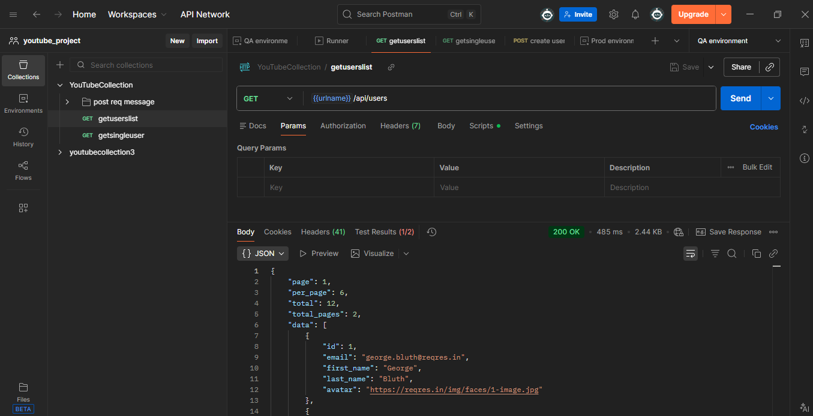

# Postman Project, using variables, scripts, tests, Newman and Jenkins 

This project involves showing typical uses cases when automating tests with Postman. We will use the https://reqres.in/ public api to carry out this project. Make sure you get your own api key and write it in the environmental variable to try these requests.

## Features
- Use of request for POST, GET, DELETE.
- Defining the scope of variables like environment, collection or global. How to use and refer to variables in Postman
- Store REST response to a variable, pass variable in a REST request message.
- Validate the results
- Creating collections, folder within collections, arranging requests within collections.
- Arrange the request messages in logical order.
- Use of Collection Runner.
- How to create Environments & Variables in a environment.
- Creating Scripts at collection level and API level.
- Tests in Postman.
- Create tests at collections, folder and API request level.
- Debugging in postman, open console,console.info, .log, .warn.
- Run from command line, install node,js and NPM.Install Newman in order to run a collection from POstman on the command line.
- Download and install Jenkins, setting up postman in Jenkins

Please import these 2 json files, collections and environment into your Postman, to make sure you can enjoy this project.Remember to get your API key from reqres.in . When in Newman stage remember to run collection together with environment to make it work as this: 
newman run <collection-file-name>.json -e <environment-file-name>.json
just replace file names and you are good to go.

